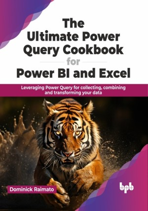

# The Ultimate Power Query Cookbook for Power BI and Excel

Novice or expert, learn to simplify and optimize data transformations

This is the repository for [The Ultimate Power Query Cookbook for Power BI and Excel
](https://bpbonline.com/products/the-ultimate-power-query-cookbook-for-power-bi-and-excel?variant=43150506623176),published by BPB Publications.

## About the Book
“The Ultimate Power Query Cookbook for Power BI and Excel” serves up easy-to-follow recipes that transform data into meaningful insights. You will learn to clean messy files, combine datasets, and even use AI magic to Power BI and Excel.

This book will walk you through the basics of getting connected to data with Power Query. You will understand how to ingest data from files, folders, databases, websites, APIs, and other third party sources. Once connected, you will learn how to transform the data so it is ready for your use. We will clean up columns, filter, replace, extract, and classify data in Power Query to meet your needs. The book offers over 100 practical recipes, ensuring you understand each step with clear explanations and examples. Lastly, we will go over advanced techniques to help optimize and simplify your transformations allowing fast refreshes all while helping you manage them in the future.

This book will help you know how to apply these techniques and recipes to your data all while understanding the implications of making certain decisions. This will enable you to have better conversations with other data professionals who are providing data for your use.

## What You Will Learn
• Learn to connect to files, databases, and third-party services.

• Manage data types and formats to optimize storage.

• Transform, create, and manipulate queries.

• Combine, merge, filter, and cleanse queries.

• Integrate artificial intelligence to accelerate insights.
